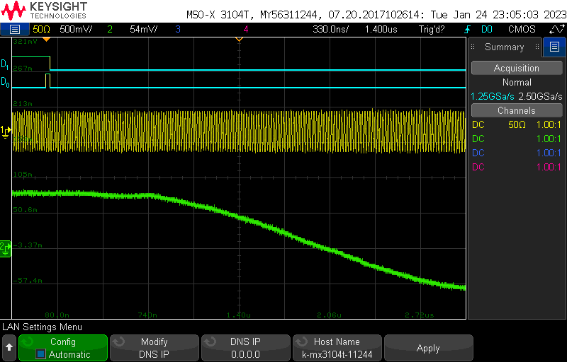
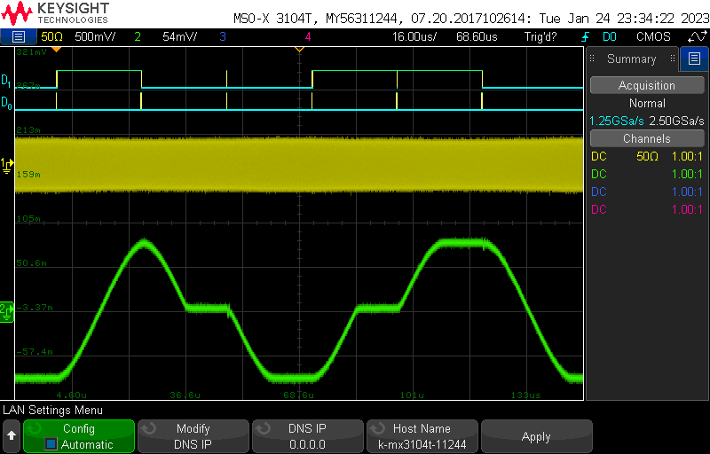
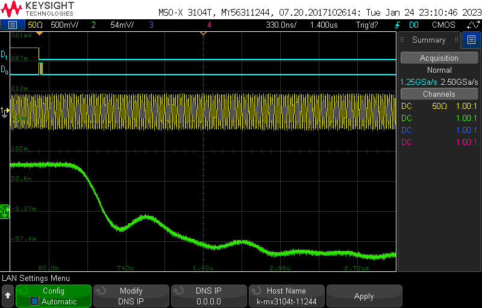
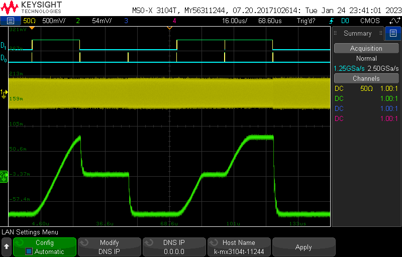
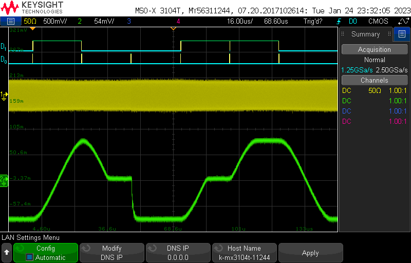
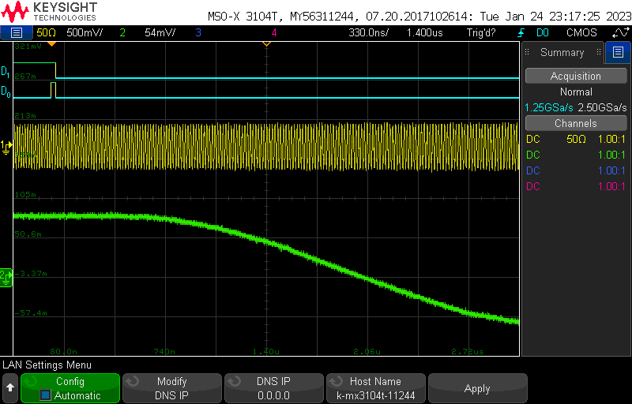
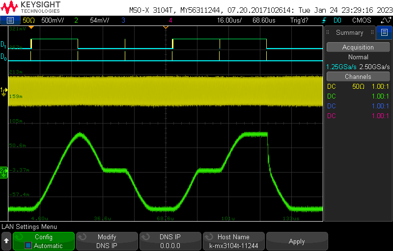

# dds-sweeper
Raspberry Pi Pico interface for the AD9959 DDS.

If you use this project, please cite as:

E. Huegler, J. C. Hill, and D. H. Meyer, An agile radio-frequency source using internal sweeps of a direct digital synthesizer,
*Review of Scientific Instruments*, **94**, 094705 (2023)
[https://doi.org/10.1063/5.0163342](https://doi.org/10.1063/5.0163342)

## Specs

- The timing capabilities of the DDS-Sweeper are tied to the number of clock cycles the pico takes to send the next instruciton.  

| Table Mode      | 1 Channel | 2 Channel | 3 Channel | 4 Channel |
|-----------------|-----------|-----------|-----------|-----------|
| Single Stepping | 500       | 750       | 1000      | 1250      |
| Sweep Mode      | 1000      | 1500      | 2000      | 2500      |

- At the default Pico Clock frequency of 125 MHz those clock cycle counts correspond to the following times:  

| Table Mode      | 1 Channel | 2 Channel  | 3 Channel  | 4 Channel  |
|-----------------|-----------|------------|------------|------------|
| Single Stepping | 4 $\mu s$ | 6  $\mu s$ | 8  $\mu s$ | 10 $\mu s$ |
| Sweep Mode      | 8 $\mu s$ | 12 $\mu s$ | 16 $\mu s$ | 20 $\mu s$ |

- The number of instructions you can store in the table depends no the type of sweep being performed and the number of channels being used.  

| Table Mode                  | 1 Channel | 2 Channel | 3 Channel | 4 Channel |
|-----------------------------|-----------|-----------|-----------|-----------|
| Single Stepping             | 5000      | 5000      | 5000      | 4032      |
| Sweep Mode                  | 5000      | 3895      | 2611      | 1964      |
| Single Stepping (Ext Timer) | 16656     | 8615      | 5810      | 4383      |
| Sweep Mode (Ext Timer)      | 8327      | 4234      | 2838      | 2135      |

## How to flash the firmware
Download the latest [dds-sweeper.uf2 file](https://github.com/naqslab/dds-sweeper/blob/main/build/ddssweeper/dds-sweeper.uf2).
On your Raspberry Pi Pico, hold down the "bootsel" button while plugging the Pico into USB port on a PC (that must already be turned on).
The Pico should mount as a mass storage device (if it doesn't, try again or consult the Pico documentation).
Drag and drop the `.uf2` file into the mounted mass storage device.
The mass storage device should unmount after the copy completes. Your Pico is now running the DDS Sweeper firmware!

## Notes
- Output Amplitude is dependent on frequency (some people on Analog Devices forum mentioned amplitude and frequency are related by a sinc function)

- The frequency resolution of the AD9959 is $= \frac{f_{sys clk}}{2^{32}}$. At the default system clock of 500 MHz, the frequency resolution is $\approx 0.1164$ Hz. Any frequency input to the dds-sweeper will be rounded to an integer multiple of the frequency resolution.

- The phase resolution of the AD9959 is $= \frac{360^\circ}{2^{14}} \approx 0.02197^\circ$. Phase offsets will be rounded to a multiple of this resolution

- The amplitude resolution of the AD9959 is $= \frac{1}{2^{10}} \approx 0.09767\%$. Amplitude scale factors will be rounded to a multiple of this resolution

## Sweeps
- Setting up a sweep:  
  
Sweeps are defined by two parameters, sweep delta and ramp rate. 
- Sweep Delta defines the change in output amplitude/frequency/phase on each sweep step
- Ramp rate defines how often a sweep step is taken. It is based off of the AD9959's sync clock signal which will be one quarter of the AD9959's system clock. The ramp rate parameter specifies the number of sync clock cycles per sweep step. A ramp rate of 1 will cause the sweep delta to be applied every 1 sync clock cycle. For upward sweeps, the ramp rate parameter can have a value of 1-255. For downward sweeps the ramp rate can only be 1.  

The time between sweep steps can be calculated with:
$$ t = \frac{\textrm{Ramp Rate}}{\textrm{Sync Clock}} $$
Using the Pico's 125 Mhz with a 4 times PLL Multiplier gives the AD9959 a system clock of 500 MHz and therefore a sync clock of 125 MHz.
For upward sweeps the time between sweeps can range from $\frac{1}{125 MHz} = 8 ns$ to $\frac{255}{125 MHz} = 2.04 \mu s$.
Downward sweeps will apply the sweep delta every $\frac{1}{125 MHz} = 8 ns$.  
Given the frequency resolution of $\frac{f_{sys clk}}{2^{32}}$, the smallest sweep delta is $= \frac{1}{2^{32}} = 0.1164$ Hz. With the maximum ramp rates, the DDS-sweeper has a minimum sweeping rate of $\approx 47871$ Hz/sec when sweeping upwards or $\approx 12207031.25$ Hz/sec when sweeping downward.

### Downward Sweeps:
Downward sweeps are not well supported by the AD9959, but they can still be done.
The best method I have found for doing a downward sweep is to send the instructions via serial first, with the sweep autoclear bit set to active and the rising sweep tuning word set to the maximum.
Then issue the IO_UPDATE signal while keeping the profile pin for that channel high.
I belive this clears the sweep accumulator then quickly refills it with a max rate sweep before beginning the downward sweep. 
Other combinations of autoclear bit active or not and timing of the profile pins seem to cause even more issues with downward sweeps.
The biggest downside of this method is that you cannot slow down the downward sweep ramp rate as much as the upward sweep ramp rate.

- Autoclear Accumulator Active, drop the pin after the update:  
  Seems to work, you just cannot slow down downward sweeps. 
    
     

- Autoclear Accumulator Active, drop the pin before the update:  
  Downward sweeps just dont work at all.  
    
    

- no autoclear, drop pin before update:  
  You cannot do consecutive down sweeps - every down sweep must be preceeded by an up sweep  
    
    

- no autoclear, drop pin after update:    
  A down sweep after an up sweep cannot cover a greater distance than the upward sweep  
    
    

- You can also generate a downward sweep by operating the AS9959 above the nyquist frequency.
This method does work but causes discontinuity when switching which band the AD9959 is working in.  

## Serial API
Note: Commands must be terminated with `\n`.

* `version`:  
Responds with a string containing the firmware version.

* `abort`:  
Stops buffered execution immediately.

* `status`:  
Returns the opperating status of the DDS-Sweeper. `0` status indicates manual mode. `1` status indicates buffered execution.

* `getfreqs`:  
Responds with a multi-line string containing the current operating frequencies of various clocks (you will be most interested in `pll_sys` and `clk_sys`). Multiline string ends with `ok\n`.

* `debug <state:str>`:  
Turns on extra debug messages printed over serial. `state` should be `on` or `off` (no string quotes required).

* `mode <sweep-type:int> <trigger-source:int>`:  
Configures what mode the DDS-Sweeper is operating in
  - 0: single stepping / manual mode
  - 1: amplitude sweep
  - 2: frequency sweep
  - 3: phase sweep  

  The operating mode must be set before buffered execution instructions can be programmed into the DDS-Sweeper.  
  A `trigger-source` of `0` means the Sweeper is expecting external triggers. A `trigger-source` of `1` means the Sweeper will send its own triggers and `set` commands will require an aditional `time` argument.
  The Sweeper must be in manual mode in order for the `setfreq`, `setphase`, and `setamp` commands to work.

* `setfreq <channel:int> <frequency:float>`:  
Manually set the output frequency of a specified channel. Channels are 0-3 and frequencies are in Hz. If `debug` is set to on, it will respond with the actual frequency set. The Sweeper must be in manual mode.

* `setphase <channel:int> <phase_offset:float>`:  
Manually set the phase offset of a specified channel. Channels are 0-3 and offsets are in degrees. If `debug` is set to on, it will respond with the actual degree offset set. The Sweeper must be in manual mode.

* `setamp <channel:int> <amplituce_scale_factor:float>`:  
Manually set the amplitude scale factor of a specified channel. Channels are 0-3 and amplitude scale factors are a precentage of the maximum output voltage. If `debug` is set to on, it will respond with the actual frequency set. The Sweeper must be in manual mode.

* `set`:  
Sets the value of instruction number `addr` for channel `channel` (zero indexed). `addr` starts at 0. It looks different depending on what mode the sweeper is in. If `Debug` is set to `on` it will respond with the actual values set for that instruction.
  - Single Stepping (mode 0): `set <channel:int> <addr:int> <frequency:float> <amplitude:float> <phase:float> (<time:int>)`
  - Sweep Mode (modes 1-3): `set <channel:int> <addr:int> <start_point:float> <end_point:float> <delta:float> <ramp-rate:int> (<time:int>)`

    `start_point` is the value the sweep should start from, and `end_point` is where it will stop. `delta` is the amount that the output should change by every cycle of the sweep clock. In the AD9959, the sweep clock runs at one quarter the system clock. `ramp-rate` is an additional divider that can applied to slow down the sweep clock further, must be in the range 1-255. The types of values expected for `start_point`, `end_point`, and `delta` different depending on the type of sweep  
      - Amplitude Sweeps (mode 1)  
        `start_point` and `end_point` should be decimals between 0 and 1 that represent the desired proprtion of the maximum output amplitude. `delta` is the desired change in that proprtion. For all three of those values there is a resolution of $\frac{1}{1024} \approx 0.09766\$
      - Frequency Sweeps (mode 2)  
        `start_point`, `end_point`, and `delta` are frequencies in Hz. They can have decimal values, but they will be rounded to the nearest multiple of the frequency resolution.
      - Phase Sweeps (mode 3)
        `start_point`, `end_point`, and `delta` are in degrees. They can have decimal values, but they will be rounded to the nearest multiple of the phase resolution (always $= 360^\circ / 2^{14} \approx 0.02197^\circ$). 

  - Sweep and Single Stepping Mode (modes 4-6): `set <channel:int> <addr:int> <start_point:float> <end_point:float> <delta:float> <ramp-rate:int> <secondary1:double> <secondary2:double> (<time:int>)`

    These modes perform a linear sweep on one of the parameters, while simulaneously single stepping on the other two parameters.
      - Amplitude Sweeps (mode 4)  
        `secondary1` is the frequency, and `secondary2` is the phase offset.
      - Frequency Sweeps (mode 5)  
        `secondary1` is the amplitude scale factor, and `secondary2` is the phase offset.
      - Phase Sweeps (mode 6)  
        `secondary1` is the amplitude scale factor, and `secondary2` is the frequency.
        

  

* `numtriggers`:  
Responds with the nmumber of triggers processed since the last call of `start`

* `setclock <mode:int> <freq:int>`:  
Reconfigures the source/reference clock.
  - Mode `0`: Use pico system clock as reference to the AD9959
  - Mode `1`: Sets the AD9959 to recieve a reference clock not from the pico

* `setmult <pll_mult:int>`:    
Sets the AD9959's pll multiplier on the Reference Clock input. The default value is 4, giving the AD9959 a system clock of 500 MHz with the pico's 125 MHz reference. Valid values are 1 or 4-20.  
If changing the reference clock and PLL multiplier, you should set the reference clock frequency first.  
The AD9959's PLL has an output range of 100-160 MHz or 255-500 MHz with VCO gain enabled. The pico will automatically enable the VCO gain bit if the requested frequency is in the upper range. If trying to use the PLL multiplier to generate a frequency between 160 and 255 MHz, there is no guarantee of operation.

* `setchannels <num:int>`:  
Sets how many channels being used by the table mode. Uses the lowest channels first, starting with channel 0. If number of channels is set to `1`, buffered execution instructions will be written to all 4 channels simultaneously.

* `save`:  
Saves the buffered execution table to nonvolatile memory so that it can be recovered later (after a power cycle). 

* `load`:  
Retrieves the buffered execution table stored in nonvolatile memory and restores it to system memory so that it can be run. A saved table must be loaded before it can be run.

