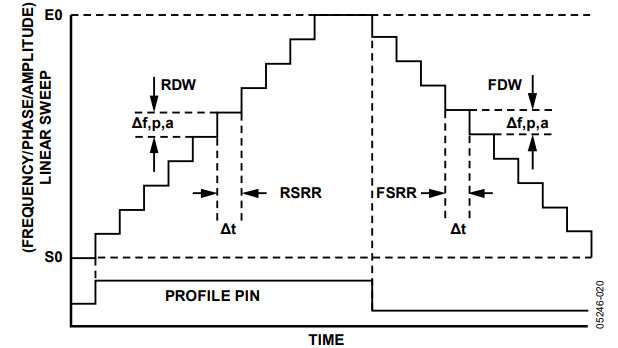
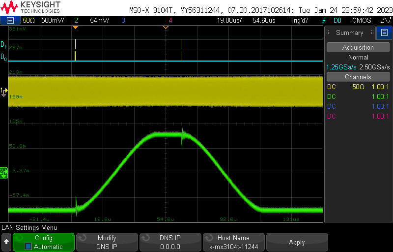

# dds-sweeper
Raspberry Pi Pico interface for the AD9959 DDS.

A similar Project:
https://github.com/Iherrbenza/AD9959_Python

## Specs

| Type            | Min Time Between Instructions                                                            | Notes |
|-----------------|------------------------------------------------------------------------------------------|-------|
| Frequency       | # of channels in use 1: 8 &#956;s 2: 12 &#956;s 3: 16 &#956;s 4: 20 &#956;s  |       |
| Phase           | # of channels in use 1: 8 &#956;s 2: 12 &#956;s 3: 16 &#956;s 4: 20 &#956;s  |       |
| Amplitude       | # of channels in use 1: 8 &#956;s 2: 12 &#956;s 3: 16 &#956;s 4: 20 &#956;s  |       |
| Single Stepping | # of channels in use 1: 4 &#956;s 2: 6 &#956;s 3: 8 &#956;s 4: 10 &#956;s    |       |

- Supports 5000 instructions

* All the minimum timings are tied to the clock speed of the Pico. The ones listed are for the default 125 MHz clock speed.
A slower base clock will require longer times between steps

## How to flash the firmware
Download the latest [dds-sweeper.uf2 file](https://github.com/naqslab/dds-sweeper/blob/main/build/ddssweeper/dds-sweeper.uf2).
On your Raspberry Pi Pico, hold down the "bootsel" button while plugging the Pico into USB port on a PC (that must already be turned on).
The Pico should mount as a mass storage device (if it doesn't, try again or consult the Pico documentation).
Drag and drop the `.uf2` file into the mounted mass storage device.
The mass storage device should unmount after the copy completes. Your Pico is now running the PrawnBlaster firmware!

## Notes
- Output Amplitude is dependent on frequency (some people on Analog Devices forum mentioned amplitude and frequency are related by a sinc function)

- The frequency resolution of the AD9959 is $= \frac{f_{sys clk}}{2^{32}}$. At the default system clock of 500 MHz, the frequency resolution is $\approx 0.1164$ Hz. Any frequency input to the dds-sweeper will be rounded to an integer multiple of the frequency resolution.

- The phase resolution of the AD9959 is $= \frac{360^\circ}{2^{14}} \approx 0.02197^\circ$. Phase offsets will be rounded to a multiple of this resolution

- The amplitude resolution of the AD9959 is $= \frac{1}{2^{10}} \approx 0.09767\%$. Amplitude scale factors will be rounded to a multiple of this resolution

## Sweeps
- Setting up a sweep:  
<!--    -->
  
Sweeps are defined by two parameters, sweep delta and ramp rate. 
- Sweep Delta defines the change in output amplitude/frequency/phase on each sweep step
- Ramp rate defines how often a sweep step is taken. It is based off of the AD9959's sync clock signal which will be one quarter of the AD9959's system clock. The ramp rate parameter specifies the number of sync clock cycles per sweep step. A ramp rate of 1 will cause the sweep delta to be applied every 1 sync clock cycle. For upward sweeps, the ramp rate parameter can have a value of 1-255. For downward sweeps the ramp rate can only be 1.  

The time between sweep steps can be calculated with:
$$ t = \frac{\textrm{Ramp Rate}}{\textrm{Sync Clock}} $$
Using the Pico's 125 Mhz with a 4 times PLL Multiplier gives the AD9959 a system clock of 500 MHz and therefore a sync clock of 125 MHz. For upward sweeps the time between sweeps can range from $ \frac{1}{125 MHz} = 8 ns $ to $ \frac{255}{125 MHz} = 2.04 \mu s $. Downward sweeps will apply the sweep delta every $ \frac{1}{125 MHz} = 8 ns $.  
Given the frequency resolution of $\frac{f_{sys clk}}{2^{32}}$, the smallest sweep delta is $ = \frac{1}{2^{32}} = 0.1164$ Hz. With the maximum ramp rates, the DDS-sweeper has a minimum sweeping rate of $\approx 47871$ Hz/sec when sweeping upwards or $\approx 12207031.25$ Hz/sec when sweeping downward.

<!-- You need to define a rising/falling delta word (RDW/FDW) as well as as a ramp rate (RSRR/FSRR). The delta words define the change in frequency/amplitude/phase that is applied on each sweep step. For frequency this is Hz, phase is degrees, and amplitude is percentage points (as in percent of maximum output voltage). The ramp rate is how often that delta word is applied. A ramp rate of 1 means the delta word is applied every clock cycle, and since the maximum clock speed of the AD9959 is 125 MHz, this gives a minimum time step of 8 ns. The max value of the ramp rate is 256, which at 125 MHz corresponds to a time interval of 2.048 &#956;s.  -->

### Downward Sweeps:
When trying to do a downward sweep you need to send an IO Update to set your new start/stop points, and you also need to drop the profile pin from high to low to actually start sweeping.

- autoclear accumulator, drop the pin before the update  
  
Downward sweeps just dont work  
  

- autoclear accumulator, drop the pin after the update  
  
might be a lot of noise on transitions  
   
cannot slow down sweeps or it breaks 

- no autoclear, drop pin before update  
  
You cannot do consecutive down sweeps - every down sweep must be preceeded by an up sweep
  

- no autoclear, drop pin after update    
  
A down sweep after an up sweep cannot cover a greater distance
  
you can slow down sweeps as much as you want

- down sweeps using up sweeps above cutoff frequency
Auto After:  
  
Auto Before:  
  
No-Auto After:  
  
No-Auto Before:  
  

## Serial API
Note: Commands must be terminated with `\n`.

* `version`:  
Responds with a string containing the firmware version.

* `abort`:  
Stops buffered execution immediately.

* `status`:  
Returns the opperating status of the DDS-Sweeper. `0` status indicates manual mode. `1` status indicates buffered execution.

* `getfreqs`:  
Responds with a multi-line string containing the current operating frequencies of various clocks (you will be most interested in `pll_sys` and `clk_sys`). Multiline string ends with `ok\n`.

* `debug <state:str>`:  
Turns on extra debug messages printed over serial. `state` should be `on` or `off` (no string quotes required).

* `setfreq <channel:int> <frequency:float>`:  
Manually set the output frequency of a specified channel. Channels are 0-3 and frequencies are in Hz. If `debug` is set to on, it will respond with the actual frequency set.

* `setphase <channel:int> <phase_offset:float>`:  
Manually set the phase offset of a specified channel. Channels are 0-3 and offsets are in degrees. If `debug` is set to on, it will respond with the actual degree offset set.

* `setamp <channel:int> <amplituce_scale_factor:float>`:  
Manually set the amplitude scale factor of a specified channel. Channels are 0-3 and amplitude scale factors are a precentage of the maximum output voltage. If `debug` is set to on, it will respond with the actual frequency set.

* `mode <sweep-type:int> <trigger-source:int>`:  
Configures what mode the DDS-Sweeper is operating in
  - 0: single stepping / manual mode
  - 1: amplitude sweep
  - 2: frequency sweep
  - 3: phase sweep  

  The operating mode must be set before buffered execution instructions can be programmed into the DDS-Sweeper.  
  A `trigger-source` of `0` means the Sweeper is expecting external triggers. A `trigger-source` of `1` means the Sweeper will send its own triggers and `set` commands will require an aditional `time` argument.

* `set`:  
Sets the value of instruction number `addr` for channel `channel` (zero indexed). `addr` starts at 0. It looks different depending on what mode the sweeper is in. If `Debug` is set to `on` it will respond with the actual values set for that instruction.
  - Single Stepping (mode 0): `set <channel:int> <addr:int> <frequency:float> <amplitude:float> <phase:float> (<time:int>)`
  - Sweep Mode (modes 1-3): `set <channel:int> <addr:int> <start_point:float> <end_point:float> <delta:float> <ramp-rate:int> (<time:int>)`

    `start_point` is the value the sweep should start from, and `end_point` is where it will stop. `delta` is the amount that the output should change by every cycle of the sweep clock. In the AD9959, the sweep clock runs at one quarter the system clock. `ramp-rate` is an additional divider that can applied to slow down the sweep clock further, must be in the range 1-255. The types of values expected for `start_point`, `end_point`, and `delta` different depending on the type of sweep  
      - Amplitude Sweeps (mode 1)  
        `start_point` and `end_point` should be decimals between 0 and 1 that represent the desired proprtion of the maximum output amplitude. `delta` is the desired change in that proprtion. For all three of those values there is a resolution of $\frac{1}{1024} \approx 0.09766\$
      - Frequency Sweeps (mode 2)  
        `start_point`, `end_point`, and `delta` are frequencies in Hz. They can have decimal values, but they will be rounded to the nearest multiple of the frequency resolution.
      - Phase Sweeps (mode 3)
        `start_point`, `end_point`, and `delta` are in degrees. They can have decimal values, but they will be rounded to the nearest multiple of the phase resolution (always $= 360^\circ / 2^{14} \approx 0.02197^\circ$). 
  

* `numtriggers`:  
Responds with the nmumber of triggers processed since the last call of `start`

* `setclock <mode:int> <freq:int>`:  
Reconfigures the source/reference clock.
  - Mode `0`: Use pico system clock as reference to the AD9959
  - Mode `1`: Sets the AD9959 to recieve a reference clock not from the pico

* `setmult <pll_mult:int>`:    
Sets the AD9959's pll multiplier on the Reference Clock input. The default value is 4, giving the AD9959 a system clock of 500 MHz with the pico's 125 MHz reference. Valid values are 1 or 4-20.  
If changing the reference clock and PLL multiplier, you should set the reference clock frequency first.  
The AD9959's PLL has an output range of 100-160 MHz or 255-500 MHz with VCO gain enabled. The pico will automatically enable the VCO gain bit if the requested frequency is in the upper range. If trying to use the PLL multiplier to generate a frequency between 160 and 255 MHz, there is no guarantee of operation.

* `setchannels <num:int>`:  
Sets how many channels being used by the table mode. Uses the lowest channels first, starting with channel 0. If number of channels is set to `1`, buffered execution instructions will be written to all 4 channels simultaneously.

* `save`:  
Saves the buffered execution table to nonvolatile memory so that it can be recovered later (after a power cycle). 

* `load`:  
Retrieves the buffered execution table stored in nonvolatile memory and restores it to system memory so that it can be run. A saved table must be loaded before it can be run.

